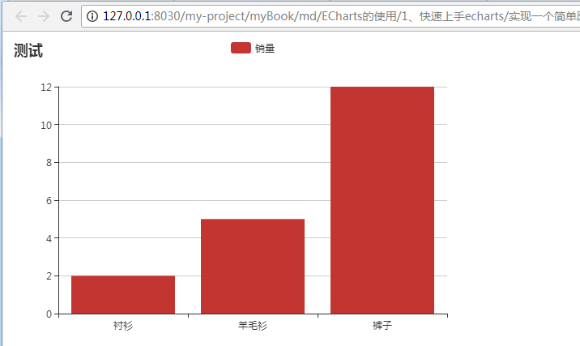

# 快速上手echarts

## 一、引入 ECharts

只需要像普通的 JavaScript 库一样用 script 标签引入。

```
<!DOCTYPE html>
<html>
<head>
    <meta charset="utf-8">
    <!-- 引入 ECharts 文件 -->
    <script src="echarts.min.js"></script>
    <!-- 或者引入 ECharts 在线地址 -->
    <script src="https://cdn.bootcss.com/echarts/4.2.0-rc.2/echarts-en.common.min.js"></script>
</head>
</html>
```

## 二、绘制一个简单的图表

绘制一个简单的图表我们只需要三步：

1. 需要一个装载图标库的容器标签
2. 通过echarts.init(ele)初始化Echarts实例，ele表示第一步创建的元素
3. 通过option指定图标的配置项和数据

**实例：**

在绘图前我们需要为 ECharts 准备一个具备高宽的 DOM 容器。

```
<body>
    <!-- 为 ECharts 准备一个具备大小（宽高）的 DOM -->
    <div id="main" style="width: 600px;height:400px;"></div>
</body>
```

然后就可以通过 echarts.init 方法初始化一个 echarts 实例并通过 setOption 方法生成一个简单的柱状图，下面是完整代码。

```
<!DOCTYPE html>
<html>
<head>
    <meta charset="utf-8">
    <title>ECharts</title>
    <!-- 引入 echarts.js -->
    <script src="echarts.min.js"></script>
</head>
<body>
    <!-- 为ECharts准备一个具备大小（宽高）的Dom -->
    <div id="main" style="width: 600px;height:400px;"></div>
    <script type="text/javascript">
        // 第一步：基于准备好的dom，初始化echarts实例
        var myChart = echarts.init(document.getElementById('main'));

        // 第二步： 指定图表的配置项和数据
	    	var option = {
				title:{     		//设置图表的标题相关内容
					text:"测试"  		//图表标题
				},
				tooltip:{},			//气泡提示框，常用于展示更详细的数据
				legend:{			//图例，表示数据和图表的关联
					data:['销量']
				},
				xAxis:{				//直角坐标系中的横轴，通常默认为类目型
					position:"bottom",
					data:["衬衫","羊毛衫","裤子"]
				},
				yAxis:{},			//直角坐标系中的纵轴，通常默认为数值型
				series:[{			//数据系列，一个图表可能包含多个系列，每一个系列可能包含多个数据
					name:"销量",
					type:"bar",
					data:[2,5,12]
				}]
			}
        // 第三步： 使用刚指定的配置项和数据显示图表。
        myChart.setOption(option);
    </script>
</body>
</html>
```

浏览器运行效果



> 此时我们就完美的完成了一个简单的图表，下面我们来介绍一下第二步中配置项的每个参数分别代表什么意思，常用的属性有哪些？

>> 1、title：设置图表的标题相关内容

>>> text：图表标题

>>> show：是否显示标题

>>> left：设置标题水平位置，left，right，center

>>> bottom：设置标题垂直位置，top，center，bottom

>>> link：主标题文本超链接

>>> target：指定窗口打开主标题超链接，self，blank

>>> padding：标题内边距

>>> textStyle：主标题样式(object)

>>> itemGap：主副标题之间的距离

>>> backgroundColor：标题背景色

>>> subtext：副标题

>>> sublink：副标题超链接

>>> substarget：指定窗口打开副标题超链接，self，blank

>>> subtextStyle：副标题样式


>> 2、tooltip：气泡提示框，常用于展示更详细的数据

>>> show：是否显示该组件

>>> axisPointer：坐标轴指示器配置项，可自定义内容

>>> alwaysShowContent：是否永远显示提示框内容

>>> triggerOn：提示框触发的条件，click:点击时触发，mousemove：鼠标移动触发，mousemove|click，同时鼠标移动和点击时触发。

>>> enterable：鼠标是否可进入提示框浮层中，默认为false，如需详情内交互，如添加链接

>>> renderMode：默认以 'html 即额外的 DOM 节点展示 tooltip,'richText' 表示以富文本的形式渲染

>>> formatter：提示框浮层内容格式器，例如：formatter:"{b}的{a}是：{c}",//{a}表示系列名，{b}数据名，{c}数据值


>> 3、legend：图例，表示数据和图表的关联

>>> data：图例的数据数组。数组项通常为一个字符串，每一项代表一个系列的 name，比如：data:['销量']；如果要设置单独一项的样式，也可以把该项写成配置项对象。

>> 4、xAxis：直角坐标系中的横轴，通常默认为类目型

>>> type：坐标轴类型，'value' 数值轴，适用于连续数据。'category' 类目轴，适用于离散的类目数据，为该类型时必须通过 data 设置类目数据。时间轴，适用于连续的时序数据，与数值轴相比时间轴带有时间的格式化,'log' 对数轴。适用于对数数据。

>>> position：坐标轴位置，top，bottom

>>> name：坐标轴名称

>>> data：类目数据，在类目轴（type: 'category'）中有效。


>> 5、yAxis：直角坐标系中的纵轴，通常默认为数值型

>> 6、series：数据系列，一个图表可能包含多个系列，每一个系列可能包含多个数据

>>> name：系列名称，要和legend中data的name对应。

>>> type：设置图标类型

>>> symbol：标记图形(用于折线图)，ECharts 提供的标记类型包括 'circle', 'rect', 'roundRect', 'triangle', 'diamond', 'pin', 'arrow', 'none'，可以通过 'image://url' 设置为图片，其中 URL 为图片的链接，或者 dataURI。

>>> symbolSize：标记图形大小(用于折线图)

>>> label：图形上的文本标签，可用于说明图形的一些数据信息，比如值，名称等

>>> areaStyle：区域填充（用于折线图）

>>> smooth：是否平滑曲线显示（用于折线图）

>>> data：系列数据


