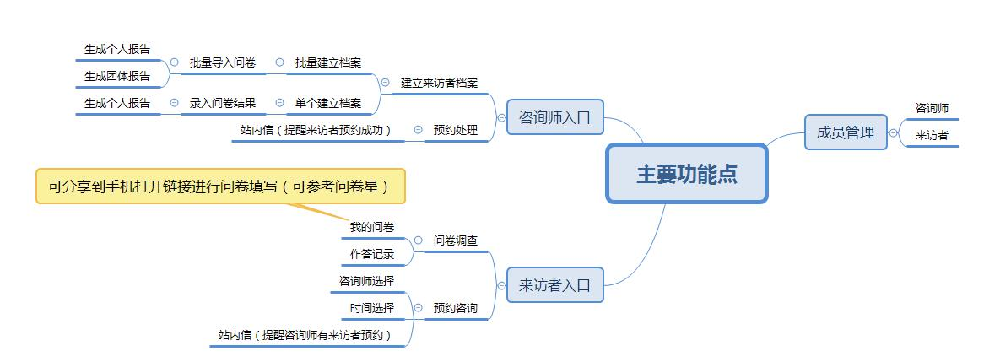
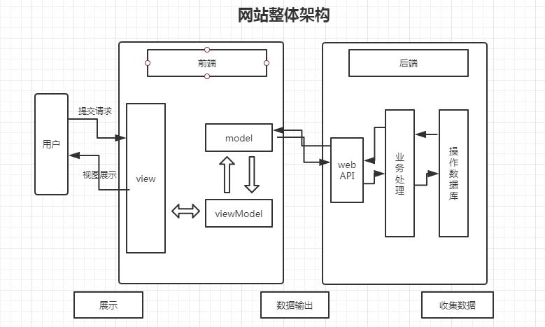
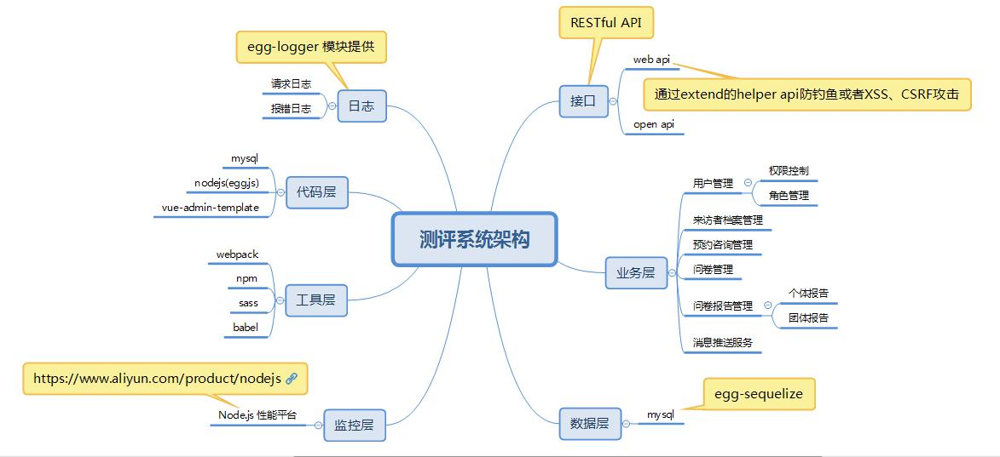
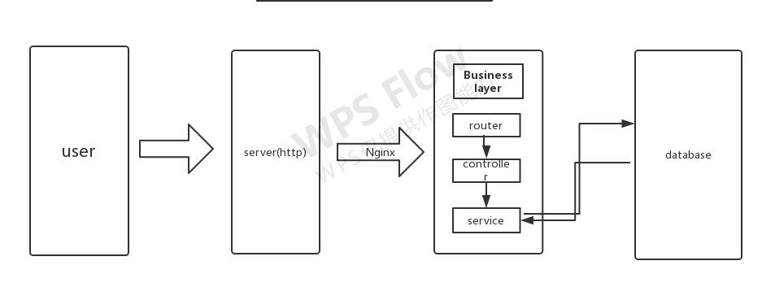
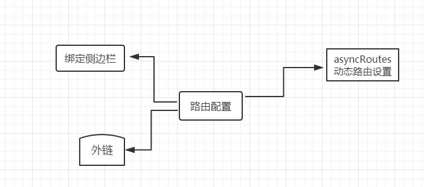
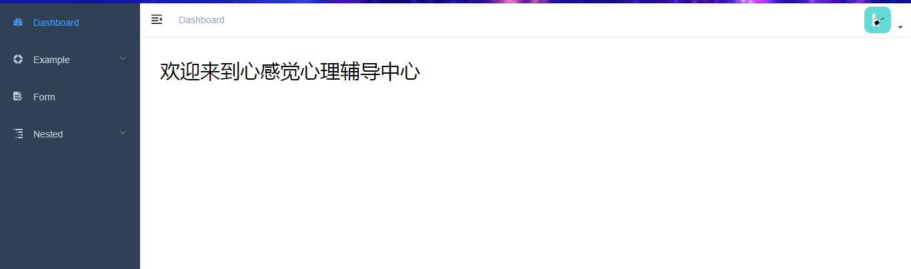
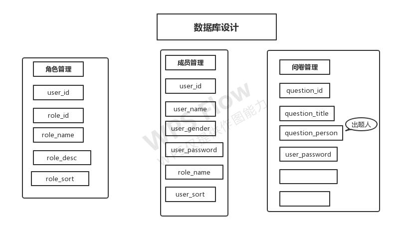

#测评系统技术规划方案

# 背景
基于egg.js+vue-admin(前后分离模式)的心理测评后台管理系统，主要是用于收集来访者资料以及问卷测评结果和咨询师预约咨询。

<!-- * 整个网站完成的三个阶段
 * 
 * 后台数据的输出
 * 客户端呈现
 * 数据的回收 -->

# 主要的功能点


# 网站架构图


# 系统技术架构图



## 一、接口协议

1、标准restful API设计接口，
RESTful 是目前最流行的用于 Web 数据接口设计的 API 设计规范。

2、接口设计统一格式
```
	"/api/xxx"
```

3、请求参数校验

使用egg-validate统一进行校验

3、安全问题

通过extend的helper api防钓鱼或者XSS、CSRF攻击

## 二、 业务层
主要收集来访者档案，问卷报告，消息推送。



## 三、日志

利用egg-logger 模块提供日志功能
1、统一错误日志，所有 logger 中使用 .error() 打印的 ERROR 级别日志都会打印到统一的错误日志文件中，便于追踪
2、启动日志和运行日志分离
3、自定义日志，比如自定义请求级别的日志
4、高性能日志：日志同步写入内存，异步每隔一段时间(默认 1 秒)刷盘

## 四、监控

对nodejs项目我们选择阿里云nodejs性能平台进行监控（目前免费使用）

主要是用来监控node的安全提醒、故障排查、性能优化。


## 五、vue-admin-template后台管理界面

1、支持无限路由嵌套，路由与功能完全解耦，并且支持外链。



2、布局风格




## 六、数据库设计



未完，待续。。。

## 七、权限验证

通过获取当前用户的权限去比对路由表，生成当前用户具的权限可访问的路由表，通过 router.addRoutes 动态挂载到 router 上。


