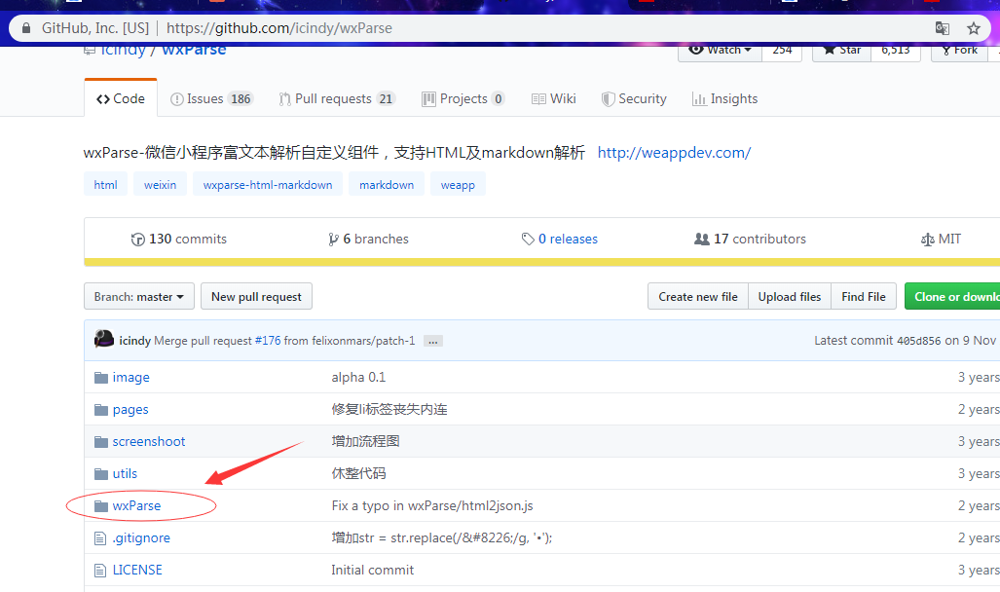
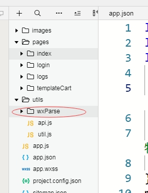

# 微信小程序富文本解析

## 一、简介

微信小程序获取到后端返回的 富文本编辑的内容时无法进行解析，此时需要用到一个插件wxParse。
wxParse-微信小程序富文本解析自定义组件，支持HTML及markdown解析
github地址：https://github.com/icindy/wxParse

## 二、用法

1. 进入GitHub地址，下载wxParse文件，并复制到小程序项目中




2. 创建一个index页面，用于展示富文本数据。

```js
在index.js中引入wxParse.js

	let WxParse = require('../../utils/wxParse/wxParse.js');

```

3. 在app.wxss中全局引入wxParse.wxss

```css
@import "./utils/wxParse/wxParse.wxss";
```

4. 在index.wxml中引入模板

```html
	<import src="../../utils/wxParse/wxParse.wxml"/>
	<template is="wxParse" data="{{wxParseData:article.nodes}}"/>
```

5. 在index.js中设置富文本数据

```js
	WxParse.wxParse('article', 'html', desc, this, 0);
	
	注：article：模板名称
		html: 转换格式
		desc: 具体数据，这个就是请求回来的富文本数据
		this: 当前对象
		0：设置padding值
```