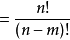

# 排列组合

排列组合是组合学最基本的概念。所谓排列，就是指从给定个数的元素中取出指定个数的元素进行排序。组合则是指从给定个数的元素中仅仅取出指定个数的元素，不考虑排序。

## 一、排列

排列的定义：从n个不同元素中，任取m(m≤n,m与n均为自然数,下同）个元素按照一定的顺序排成一列，叫做从n个不同元素中取出m个元素的一个排列；从n个不同元素中取出m(m≤n）个元素的所有排列的个数，叫做从n个不同元素中取出m个元素的排列数，用符号 A(n,m）表示。

计算公式：    

**此外规定0!=1(n!表示n(n-1)(n-2)...1,也就是6！=6x5x4x3x2x1**

## 二、组合

组合的定义：从n个不同元素中，任取m(m≤n）个元素并成一组，叫做从n个不同元素中取出m个元素的一个组合；从n个不同元素中取出m(m≤n）个元素的所有组合的个数，叫做从n个不同元素中取出m个元素的组合数。用符号 C(n,m) 表示。