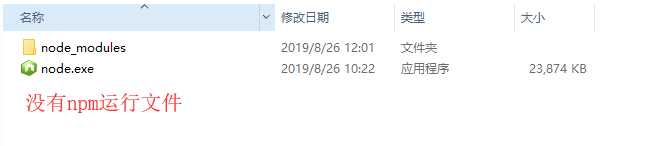
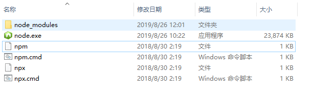

# nvm安装后node生效但是npm不生效

问题
使用nvm安装nodeJS之后，node -v命令可以正常使用，但是npm命令一直报“npm不是内部命令”的错误

问题解决

目前发现 8.11以上版本的node版本对应的npm都没法自动安装，
需要自己到npm官网( https://npm.taobao.org/mirrors/npm/)
下载手动安装对应的npm版本
1、进入nvm下的指定的node版本目录发现目录下没有npm运行文件
2、进入node_modules发现文件夹为空



3、自己下载node对应的npm版本
4、解压后将文件夹重命名为npm并复制到node_modules目录下
5、最后将npm中bin目录下的npm以及npm.cmd复制到与node_modules目录同级目录下



6、此时npm命令即可使用，如果不能使用需要使用

```
	nvm use node版本号
```