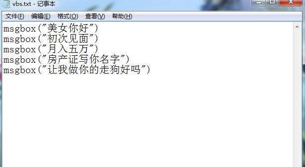
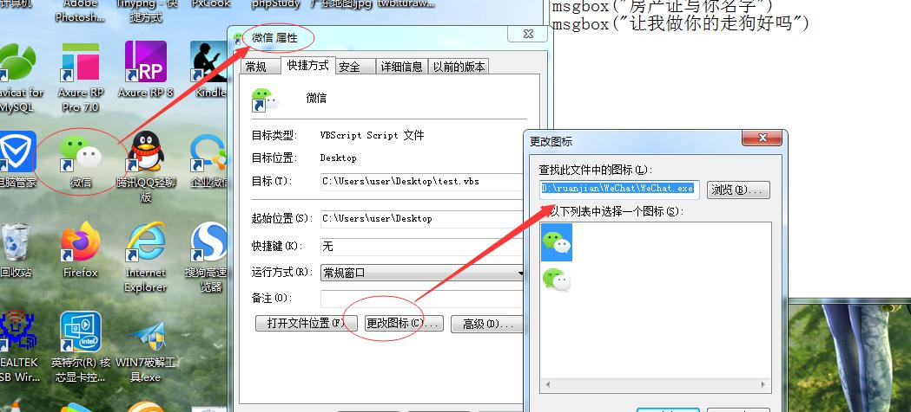

# 快速创建一个仿微信桌面应用

1、新建一个文本文档，并写入一下代码

```
msgbox("美女你好")
msgbox("初次见面")
msgbox("月入五万")
msgbox("房产证写你名字")
msgbox("让我做你的走狗好吗")
```



2、修改文本文档的名称及后缀test.vbs


3、通过如图步骤获取微信图标，并复制图标路径



4、为test.vbs文件创建一个快捷方式

修改快捷方式名称为“微信”，并修改快捷方式的图片为微信图标

最终结构如下图，搞定！！！

