# 如何将nodejs项目部署到线上

假设你有一台云服务器，并且安装好了宝塔,以及所需要用到的软件，比如：nodejs,pm2,nginx,msql,phpmyadmin，php等

## 1、准备一个nodejs项目

如下图

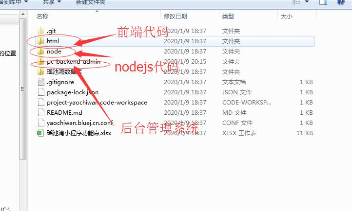

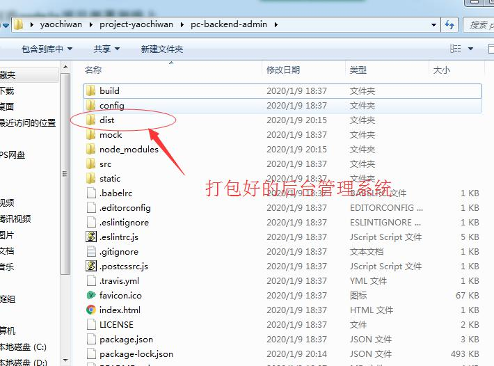
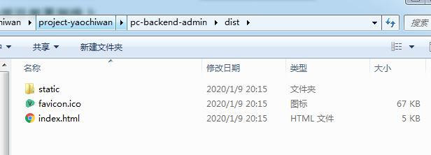

## 2、通过宝塔创建一个站点

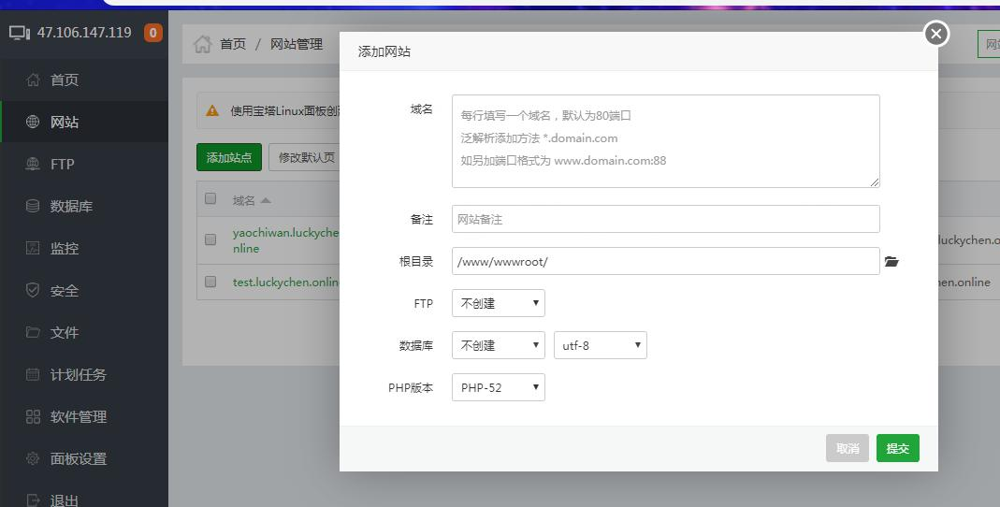

将域名填写好即可

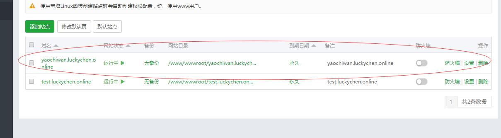

## 3、登录服务器将下面node文件导入服务器

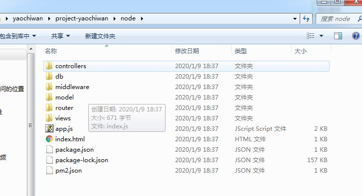

这里通过finalShell登录服务器
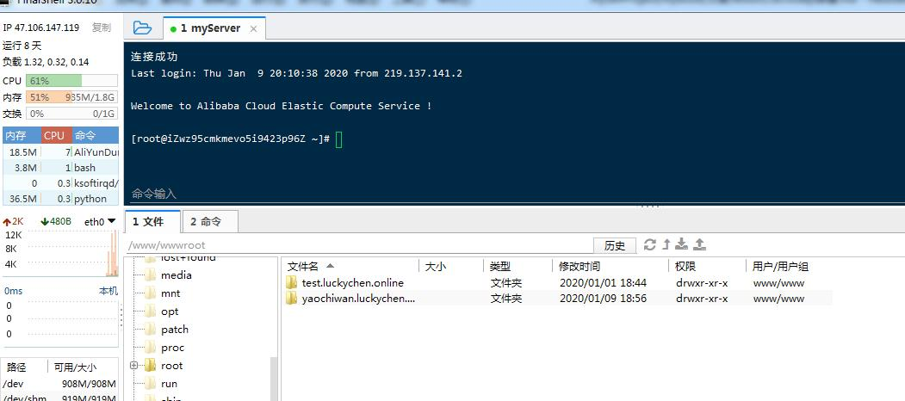

登录后可以看到我们刚才在宝塔中创建的站点，默认是在/www/wwwroot这个目录下

然后进入目录把后台nodejs文件上传到该站点目录下
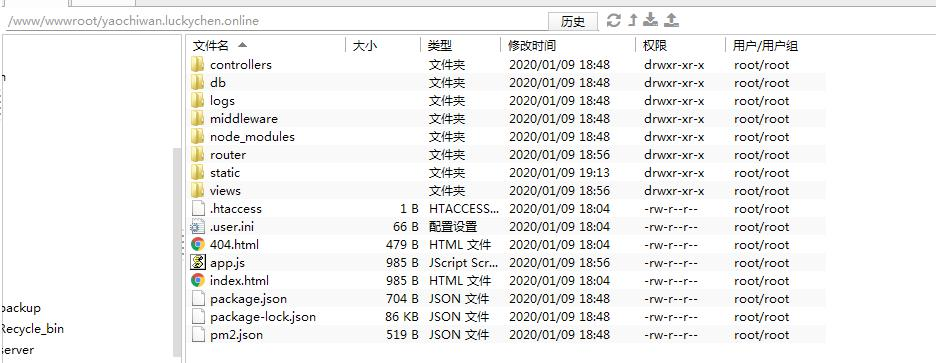

## 4、然后导入数据库

进入宝塔数据库面板，点击添加数据库即可将本地数据库中的数据库导入线上

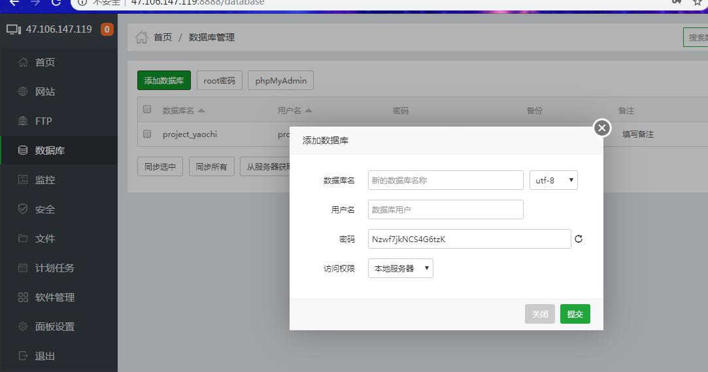

提交后即可看到自己导入的数据库
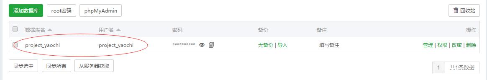

## 5、配置Nginx

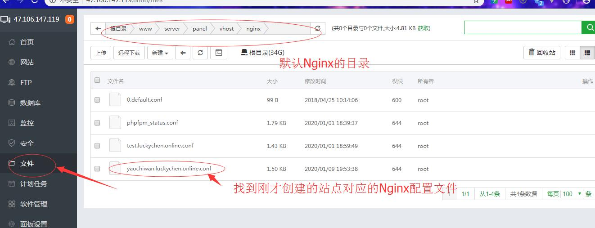

点击编辑，进入编辑状态，添加配置如下：
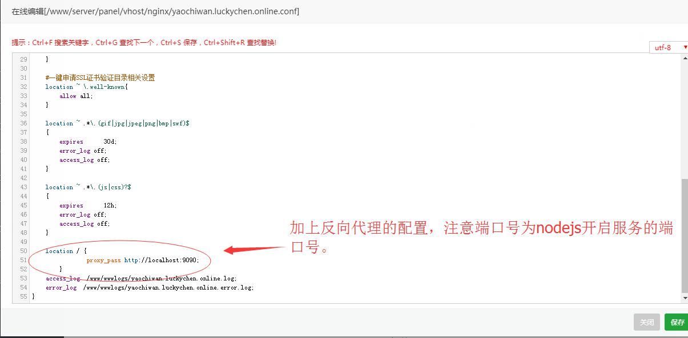

## 6、登录阿里云服务器（根据自己购买的服务器），添加端口号安全组。

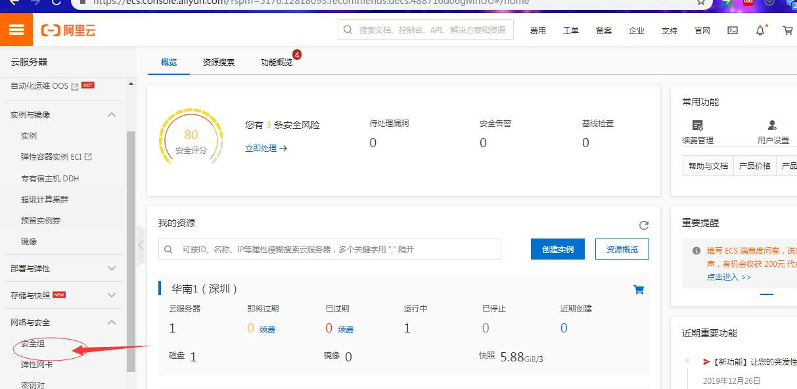
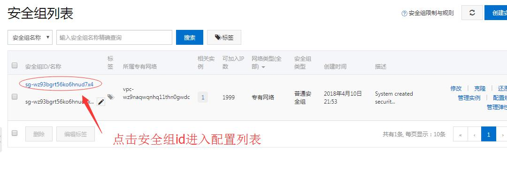
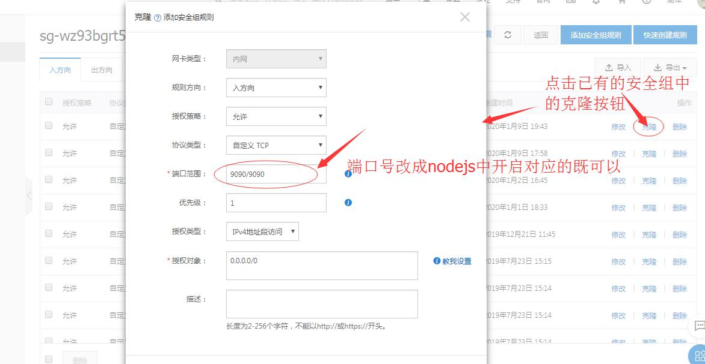

## 7、回到第3步中用finalShell登录的服务器中

找到在宝塔中建立的站点，通过pm2开启node服务

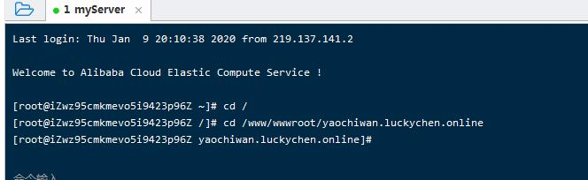

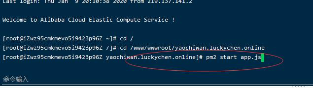

开启成功后，输入命令pm2 list即可看到我们的服务已经在运行了。

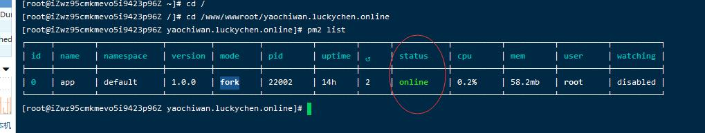

到此我们的后台就已经部署完成了，撒花！！！

## 8、最后我们要把后台管理系统和前端代码部署到线上

我们知道，我们把后台代码都放到了服务器站点的根目录，如果把前端和后台管理系统的代码也放到根目录的话，内容看起就很多而且比较乱了。
因此我们通常会把后台管理系统和前端代码放到一个静态文件夹下面

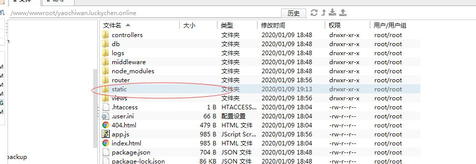
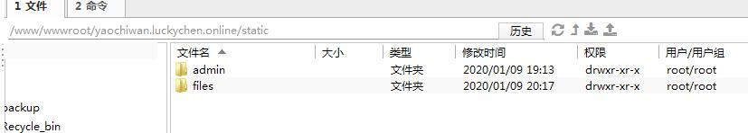
然后我们就可以把前端代码放到这个static文件夹下即可。

后台管理系统代码我们会在static文件夹下再创一个admin文件夹，将后台管理系统代码放到admin文件夹中。

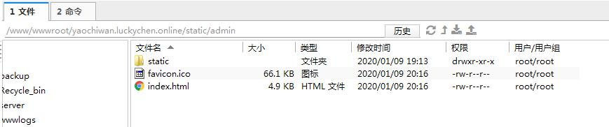
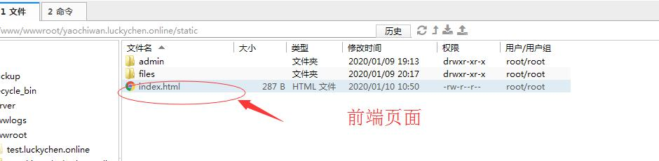

## 9、最后的最后，再回来Nginx配置这里

修改配置，将域名指向static这个文件夹

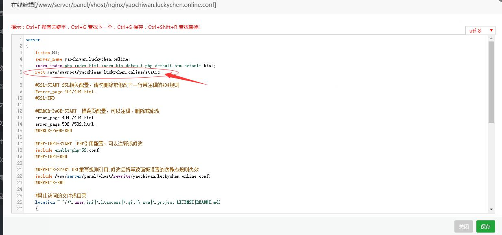

保存关闭，重启Nginx配置即可。
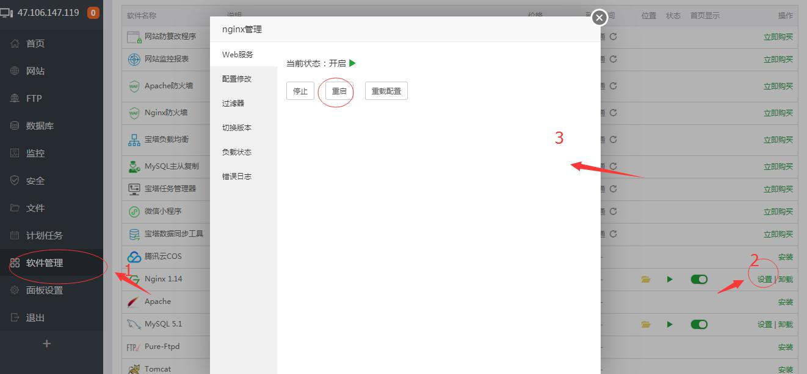

[访问域名](http://yaochiwan.luckychen.online)：http://yaochiwan.luckychen.online

即可访问到前端页面
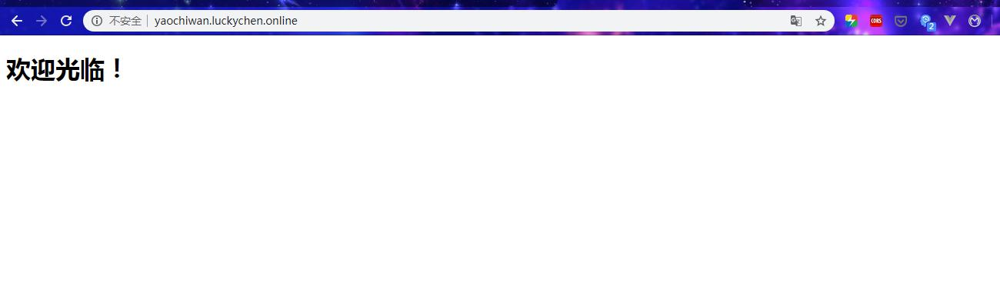

[访问域名](http://yaochiwan.luckychen.online/admin)：http://yaochiwan.luckychen.online/admin
即可访问到后台管理系统
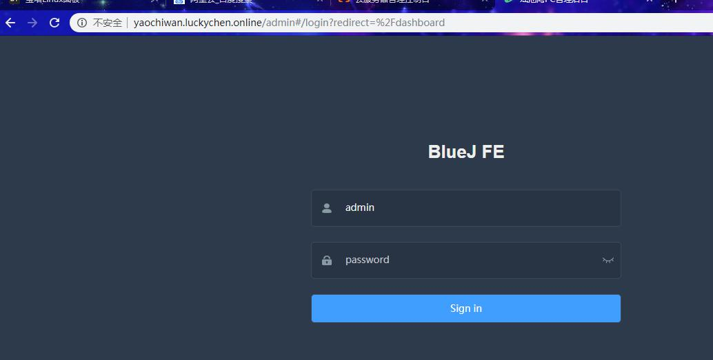

至此，全部完成！

安装宝塔在“服务端知识”篇有讲到。