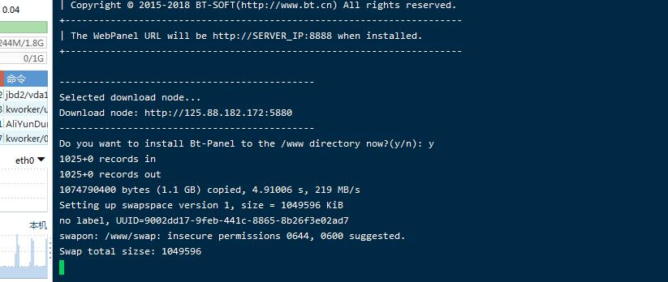
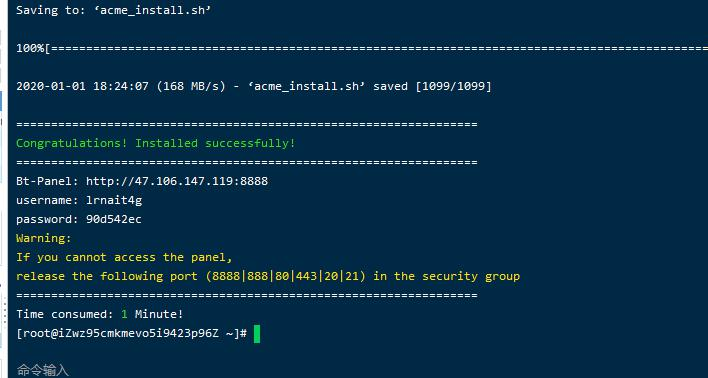
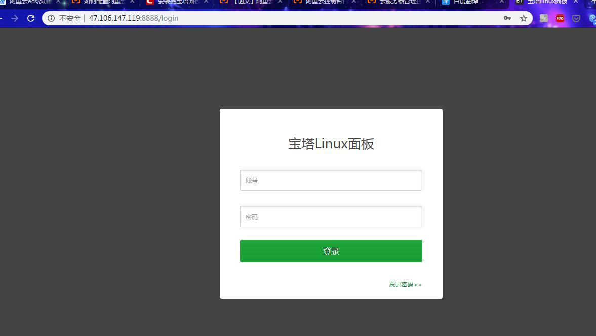
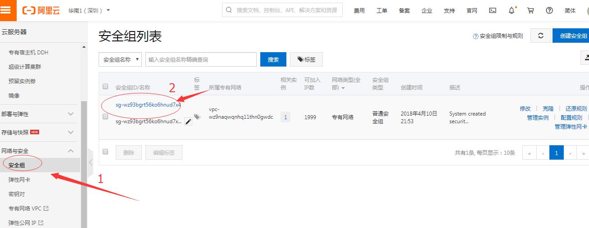
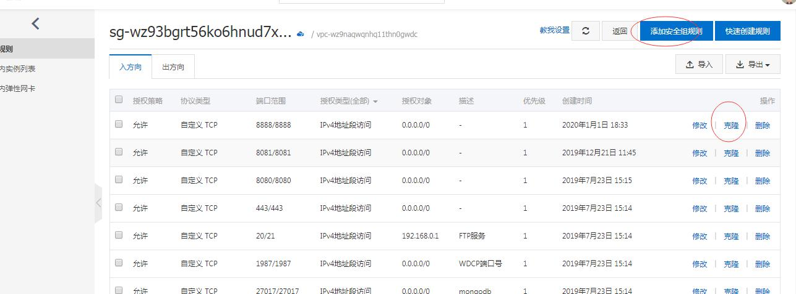

# centos安装宝塔面板

1、下载

```
yum install -y wget && wget -O install.sh http://download.bt.cn/install/install.sh && sh install.sh
```



这里询问你是否安装面板，输入 y。 这个面板应该是一直在完善当中，就例如这块，其实应该加入一个默认安装敲击回车确认安装的过程。

好了，我们开始进入安装程序，因为是一键安装，1核2G的服务器时间大约5分钟左右安装完成。


安装的过程中会有红色提醒
 
DEPRECATION: Python 2.6 is no longer supported by the Python core team, please upgrade your Python. A future version of pip will drop support for Python 2.6
 
百度翻译了一下大意是，Python2.6 官方已经不支持了，慎用。不过不是什么大事，可以忽略。




面板安装的速度挺快，最后会给你一个ip加默认8888端口号的面板账号密码，密码是自动生成的。
 
登录地址：http://xxx.xx.xxx.xxx:8888/ 
（xxx.xx.xxx.xxx是你服务器的公网ip。一般是这个格式的，不过第一次进去之后，可以设置绑定域名登录）

出现如下界面，说明你的linux宝塔面板已经安装完毕。


如果无法访问面板，请释放安全组中的以下端口（8888 | 888 | 80 | 443 | 20 | 21）



安全组通过点击实例名称进入设置面板，可通过点击克隆或者添加安全组规则即可。
