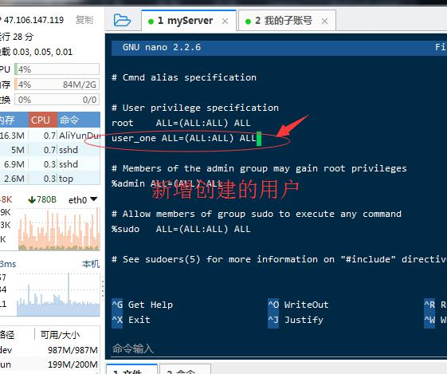
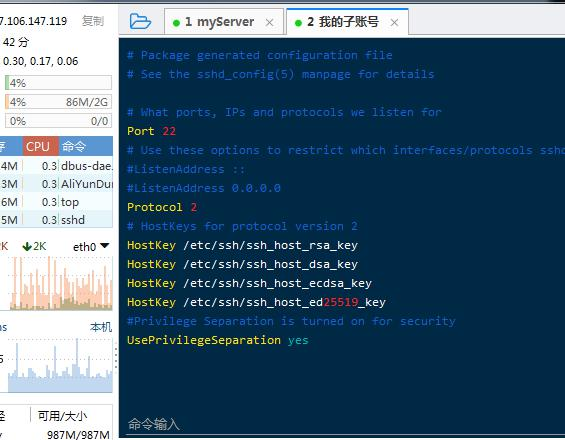
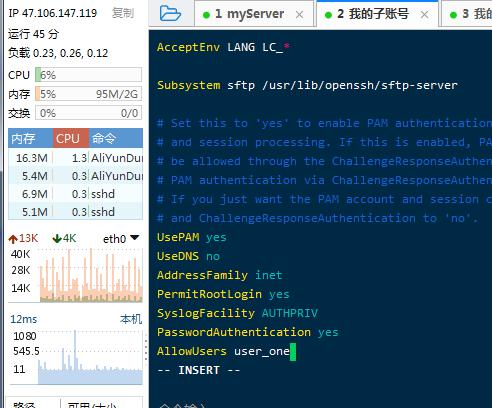

ubuntu常见命令

1、查看每个盘
```
df -h
```

2、设置权限

设置子账号

```
添加子账号 ：manager_one
adduser manager_one
```

设置子账号权限(升权)

```
gpasswd -a manager_one sudo
```

3、打开配置文件，修改manager_one的权限

```
sudo visudo
```



4、增强服务器安全

(1)修改端口号


```
sudo vi /etc/ssh/sshd_config

然后按下i进行编辑

sudo -- 表示管理员权限
```






(2)保存修改并退出
```
按下Esc键退出编辑，然后按:wq!保存并退出
```

(3)重启服务

```
sudo service ssh restart
```
